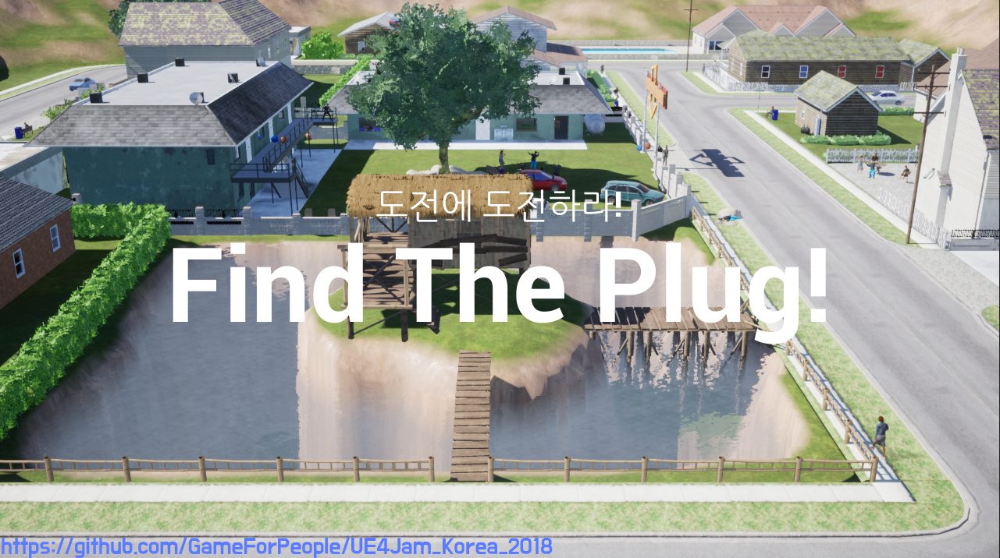
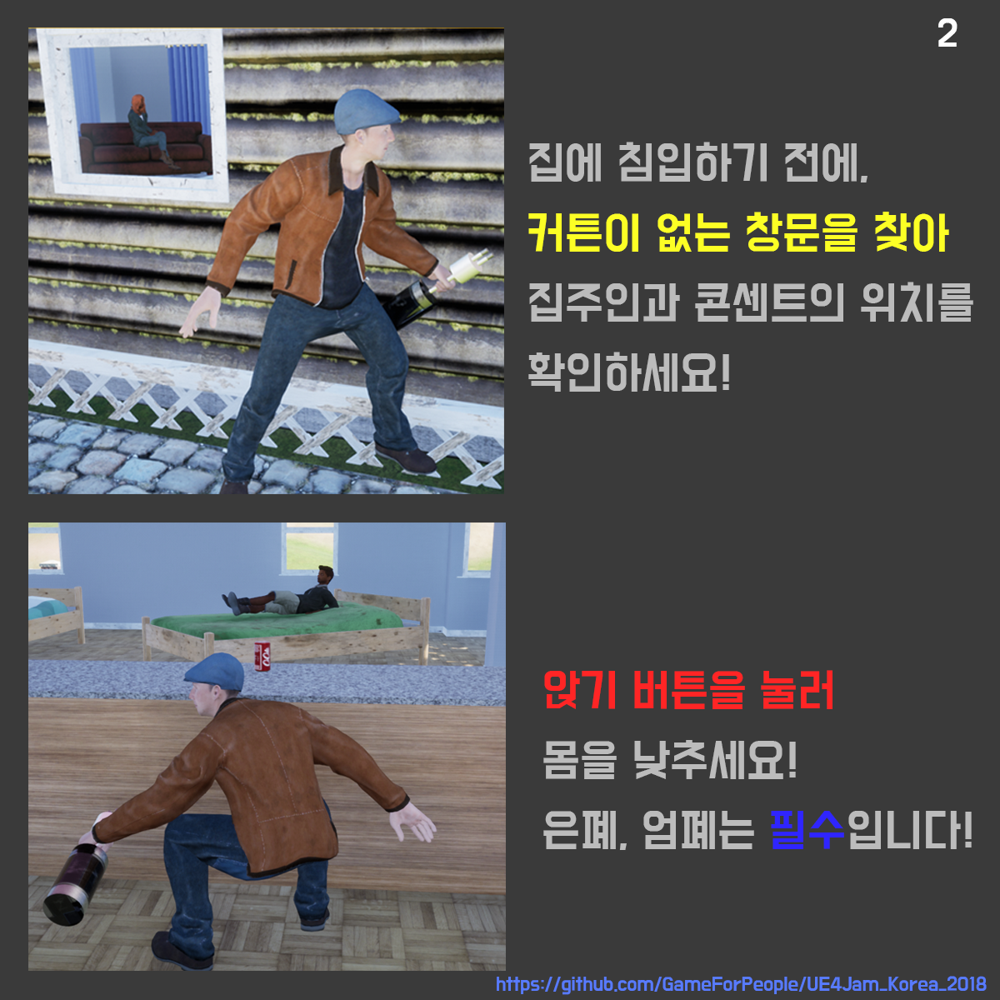
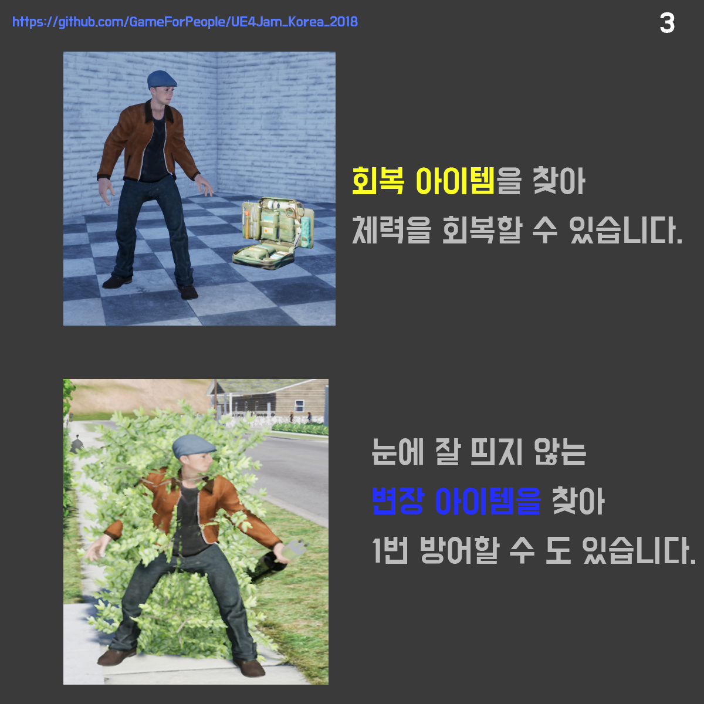
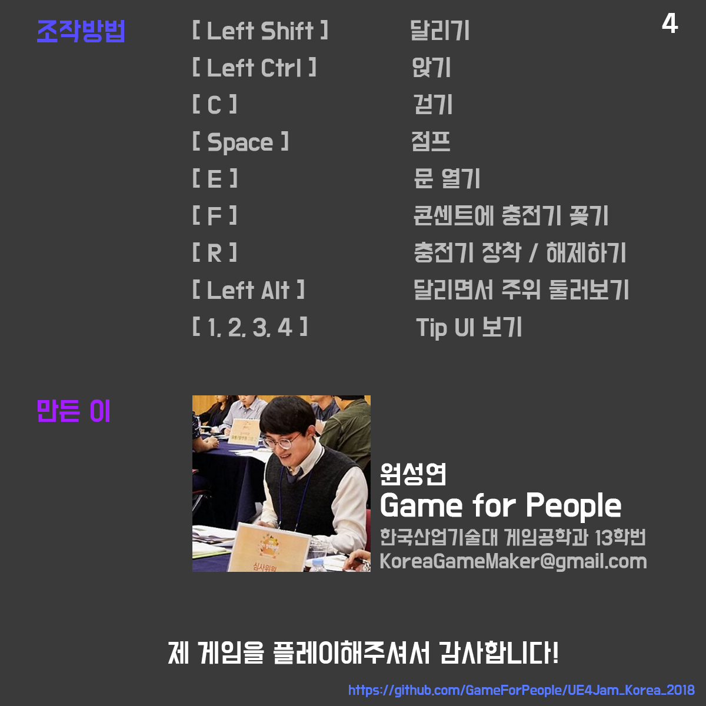
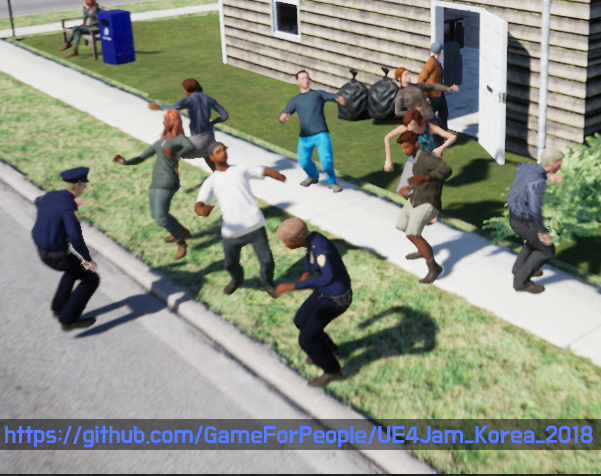
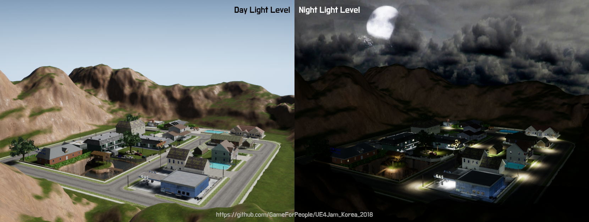

# UE4Jam_Korea_2018
__도전에 도전하라 : "Find the plug!" project 저장소에 방문해주셔서 감사합니다!__

> 이 프로젝트는, UE4Jam Korea 2018에 출품한 작품으로, 언리얼엔진4로 제작되었습니다. 3일의 짧은 기간동안 1인 개발로 진행되어 많은 부분이 미흡하니 양해부탁드립니다.
>
> 이 프로젝트에는 상업적인 리소스가 포함되어 부득이하게 대다수의 리소스가 커밋 및 푸시에서 제외되었으며, 이는 이 프로젝트를 클론 및 다운로드하더라도 에디터에서의 프로젝트 오픈이 어려움을 뜻합니다. 

About Project
---------
>__Find the Plug!은 마을을 돌아다니며, 이웃들의 집에 잡입하여 집주인 몰래 콘센트에 배터리를 연결하여 전기를 충전하는 게임입니다.__ 
>
>이러한 컨셉은 UE4Jam Korea 2018의 주제인 "도전(挑戰)" 이라는 단어와, 발음은 동일하지만 또 다른 뜻의 "도전(盜電)"{전력을 몰래 훔쳐 씀} 에서 아이디어를 얻어, "전기세를 내지 못해 집에 전기가 끊긴, 인디게임개발자 원성연이, UE4Jam 코리아 2018에 참가하기 위해, 마을 이웃들의 집에 몰래 들어가 배터리를 충전한다"는 컨셉으로 디자인하였습니다. 
>
>이러한 독특한 컨셉에 적합하도록 밝은 BGM과 익살스러운 애니메이션, 엽기적인 레벨 디자인 등을 활용하여 캐주얼적인 특징을 강조하였고, 잠입 액션 특유의 퍼즐성 또한 구현하여, 플레이어들에게 새로운 경험을 제공하고자 노력했습니다.

Play Movie
---------
> <- 클릭 :)

How To Play
--------
__아래 사진들은 인게임 튜토리얼 팝업이미지 입니다.__

> 아래 경로에서 패키징된 실행파일을 다운로드 받으실 수 있습니다.
>* Version 0.2 (2018-07-30) [Download Link (Google Drive)][1] // UE4Jam Korea 2018 ver
>* Version 0.4 (2018-08-04) [Download Link (Google Drive)][2] // 추가 구현사항으로 최적화 이슈가 발생할 수 있습니다. 

재밌게 플레이해주세요!

감사합니다. :)

> __Version List__
>* Version 0.1 (2018-07-29) 최초 패키징 버전
>* Version 0.2 (2018-07-30) SuccessVFX 추가, SuccessSFX 제거, MultiOverlap exception handling
>* Version 0.3 (2018-08-01) Private: Adjust Precomputed Lighting Scenarios ( Day, Night )
>* Version 0.4 (2018-08-04) Adjust Precomputed Lighting Scenarios ( Day, Night ), Etc Bug Fix
> 

> __Known bugs__
> 1. 0.4 버전으로 실행 시, 최적화되지 않은 Precomputed Lighting Scenarios의 LevelStreaming이 적용되어 있습니다. 이는 충분한 고사양의 컴퓨터가 아닐 경우, 프레임 저하 혹은 프로그램 다운이 일어날 수 있습니다. (i7-8700k과 동급 혹은 그 이상의 프로세스, gtx1080ti 과 동급 혹은 그 이상의 그래픽 카드 권장)
> 2. 충전을 시도할 때, 간헐적으로 배터리가 플러그에 위치하지 않으며 프로그램 다운이 일어날 수 있습니다. ( Non Ref Error )
> 3. 0.4 버전일 경우, Night Light에서 플레이하기 어려울 정도로 어두운 부분이 존재합니다.
> 4. 게임 엔딩 시 (Bad Ending, Happy Ending 모두) 게임 종료를 원할 시, 윈도우 키를 누른 후 작업표시줄에서 마우스 오른쪽 클릭을 통해 종료할 수 있습니다.
> 5. 시나리오 Pass 시, Pass UI가 조금 늦게 없어지며 Tip UI출력이 늦는 오류가 발생합니다.
> 6. 차와 플레이어가 충돌 시, 레벨에 배치된 블로킹 볼륨보다 큰 Height Value를 가지는 경우가 생길 수 있으며, 이는 의도치 못한 끼임 현상이나, 레벨 언로드 현상이 발생할 수 있습니다.
> 7. 텍스쳐 UV문제로 비정상적인 라이팅 및 새도우가 출력되는 문제가 발생합니다.

[1]:https://drive.google.com/open?id=1dmDOBL34az80TLjYGfEAXXLuSLGWBLla
[2]:https://drive.google.com/open?id=1zp7D652sSwpT4-Tf2jwDFPSgvQ-3T6p2
