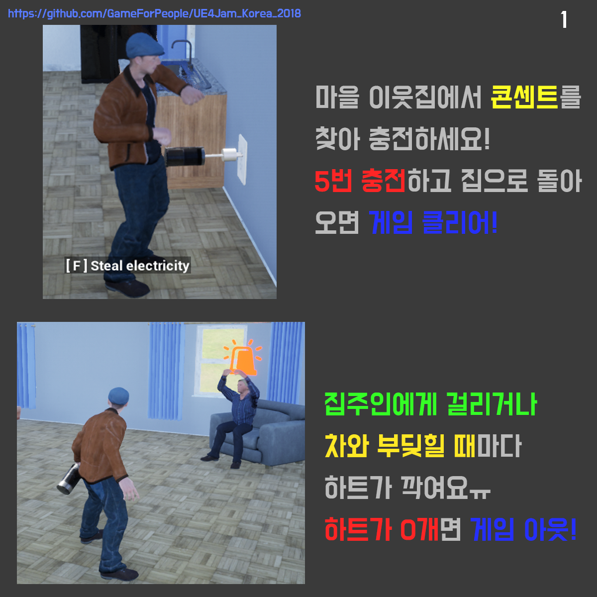

# UE4Jam_Korea_2018
__도전에 도전하라 : "Find the plug!" project 저장소에 방문해주셔서 감사합니다!__

> 이 프로젝트는, UE4Jam Korea 2018에 출품한 작품으로, 언리얼엔진4로 제작되었습니다. 
3일의 짧은 기간동안 1인 개발로 진행되어 많은 부분이 미흡하니 양해부탁드립니다.

About Project
---------
>__Find the Plug!은 마을을 돌아다니며, 이웃들의 집에 잡입하여 집주인 몰래 콘센트에 배터리를 연결하여 전기를 충전하는 게임입니다.__ 
>
>이러한 컨셉은 UE4Jam Korea 2018의 주제인 "도전(挑戰)" 이라는 단어와, 발음은 동일하지만 또 다른 뜻의 "도전(盜電)"{전력을 몰래 훔쳐 씀} 에서 아이디어를 얻어, "전기세를 내지 못해 집에 전기가 끊긴, 인디게임개발자 원성연이, UE4Jam 코리아 2018에 참가하기 위해, 마을 이웃들의 집에 몰래 들어가 배터리를 충전한다"는 컨셉으로 디자인하였습니다. 
>
>이러한 독특한 컨셉에 적합하도록 밝은 BGM과 익살스러운 애니메이션, 엽기적인 레벨 디자인 등을 활용하여 캐주얼적인 특징을 강조하였고, 잠입 액션 특유의 퍼즐성 또한 구현하여, 플레이어들에게 새로운 경험을 제공하고자 노력했습니다.

How To Play
--------
__아래 사진들은 인게임 튜토리얼 팝업이미지 입니다.__

> 아래 경로에서 패키징된 실행파일을 다운로드 받으실 수 있습니다.
>* Version 0.2 (2018-07-30) [Download Link (Google Drive)][1] 

재밌게 플레이해주세요!

감사합니다. :)

>* Version 0.1 (2018-07-29) 최초 패키징 버전
>* Version 0.2 (2018-07-30) SuccessVFX 추가, SuccessSFX 제거, MultiOverlap exception handling
>* Version 0.3 (2018-08-01) Private: Adjust Precomputed Lighting Scenarios ( Day or Night )

[1]:https://drive.google.com/open?id=1dmDOBL34az80TLjYGfEAXXLuSLGWBLla
